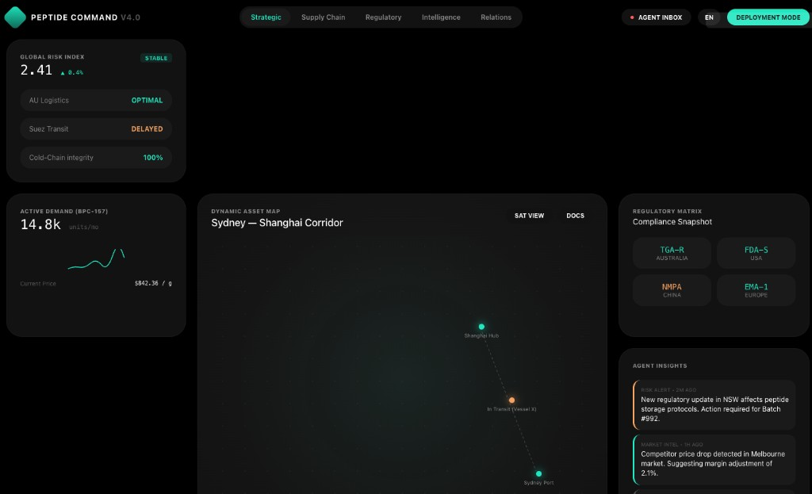

# Peptide Command — 功能设计文档 v0.2

> **文档性质**：产品功能、系统设计与 UI 视觉规范  
> **来源需求**：《AI Agent 平台功能期望 - Steven Lu 20260618.md》  
> **整理日期**：2026-06-18  
> **状态**：Draft — 视觉风格已确认（Command Center V4），可进入 P0 开发

---

## 一、产品定位

### 1.1 一句话定义

**Peptide Command** 是一个多肽跨境供应链情报与决策系统：用一张动态地图，把监管、文件、供应商、客户、价格、需求和风险全部连接起来，让小团队以低成本、高速度、可复制的方式推进澳大利亚及其他市场的多肽业务。

### 1.2 不是什么

- 不是静态资料库或一次性调研报告
- 不是单纯的市场调研笔记系统
- 不是替代本地销售（Nick）的关系网络工具

### 1.3 核心目标

| 目标 | 含义 |
|------|------|
| 3 人做 30 人的事 | 替代大量人工搜索、整理、追踪、跨团队同步 |
| 同一张地图 | 所有角色基于同一套结构化信息协作 |
| 长期运行 | 持续监控与更新，而非一次性产物 |

### 1.4 已确认的产品偏好（2026-06-18）

| 项 | 决策 |
|----|------|
| 首页视角 | **战略视图**（Steven / 决策层优先），非销售一线视图 |
| 通知渠道 | **不走飞书**；使用平台内 Alert Center + 可选 Email / 浏览器 Push |
| 语言 | **中英双语**，切换模式（用户选中文或英文，界面不同时显示两种语言） |
| 视觉风格 | **Command Center V4**（深色指挥中心风格，见第四章） |

---

## 二、用户角色与权限

| 角色 | 典型用户 | 主要使用场景 |
|------|----------|--------------|
| 战略决策 | Steven | 全局地图、风险总览、机会排序、路径取舍 |
| 运营 / 合规 | 运营成员 | 文件矩阵、监管变化、路径可行性维护 |
| 本地销售 | Nick | 查看销售情报包、客户文件清单、价格对比（只读或受限编辑） |
| 任意成员 | 全员 | Agent Inbox 异步输入信息 |

**权限原则**：

- 地图与矩阵：全员可读；编辑需对应模块权限
- Agent 写入：一律经「确认卡片」后落库
- 敏感节点备注（如灰色渠道）：可设可见范围

---

## 三、信息架构

### 3.1 模块总览

平台共 8 个功能模块，以 **Supply Chain Map** 为中枢，其余模块均与之交叉引用。

```
                    ┌─────────────────────┐
                    │  Strategic Home     │  ← 首页（战略视图）
                    │  + Supply Chain Map │
                    └──────────┬──────────┘
                               │
     ┌─────────┬─────────┬─────┴─────┬─────────┬─────────┐
     ▼         ▼         ▼           ▼         ▼         ▼
 Regulatory  Document  Market    Supplier/   Risk      Agent
  Matrix     Tracker  Intel       CRM    Watchtower   Inbox
     │         │         │           │         │         │
     └─────────┴─────────┴─────┬─────┴─────────┴─────────┘
                               ▼
                    Alert & Action Center
```

### 3.2 导航结构

**一级导航**（顶部 Pill Tab，参考 V4 设计稿）：

| Tab | 英文 | 默认页 | 包含子模块 |
|-----|------|--------|------------|
| 战略 | Strategic | ✅ 默认 landing | 战略首页、Risk Watchtower 摘要 |
| 供应链 | Supply Chain | — | Supply Chain Map、Document Tracker |
| 监管 | Regulatory | — | Regulatory Matrix、合规快照 |
| 情报 | Intelligence | — | Market Intelligence、SKU 机会 |
| 关系 | Relations | — | Supplier & Customer CRM |

**顶部右侧常驻控件**：

| 控件 | 说明 |
|------|------|
| Agent Inbox | 带未读红点的入口，打开侧栏或抽屉 |
| 语言切换 | `EN` / `中`  pill 切换，整站单一语言 |
| Deployment Mode | 主操作按钮（Teal 高亮），用于路径部署 / 确认 Agent 变更等待决策动作 |

**二级导航**：进入各 Tab 后，左侧或 Tab 下方展示子模块切换（如 Supply Chain → Map / Documents）。

---

## 四、UI 视觉规范（Command Center V4）

> **参考稿**：`assets/peptide-command-v4-reference.png`  



> **风格关键词**：Dark Command Center · HUD · 数据密集型 · 战略级仪表盘

### 4.1 设计原则

| 原则 | 说明 |
|------|------|
| 指挥中心感 | 深色背景 + 高对比数据，像实时作战面板而非企业 ERP |
| 数据优先 | 大数字 KPI 优先，次要标签弱化 |
| 状态语义化 | 颜色 + 文字双重编码（如 OPTIMAL / DELAYED / STABLE） |
| 地图即中心 | 战略首页中央永远是 Dynamic Asset Map |
| 克制用色 | 黑/灰为主，Teal 表正常/活跃，Orange 表警告，Red 仅用于 Alert |

### 4.2 色彩系统

| Token | 色值 | 用途 |
|-------|------|------|
| `--bg-base` | `#000000` | 页面底色 |
| `--bg-card` | `#0A0A0A` ~ `#111111` | 卡片容器 |
| `--bg-card-elevated` | `#1A1A1A` | 悬浮 / 激活卡片 |
| `--border-subtle` | `#2A2A2A` | 卡片描边、网格线 |
| `--text-primary` | `#FFFFFF` | 主标题、KPI 数值 |
| `--text-secondary` | `#9CA3AF` | 标签、副标题 |
| `--text-muted` | `#6B7280` | 时间戳、辅助说明 |
| `--accent-teal` | `#14B8A6` ~ `#2DD4BF` | 主强调：Logo、活跃 Tab、正常节点、主按钮 |
| `--accent-orange` | `#F97316` ~ `#FB923C` | 警告：延误、在途风险、Risk Alert 边框 |
| `--accent-green` | `#22C55E` | 稳定 / 上升 / OPTIMAL |
| `--accent-red` | `#EF4444` | Alert 未读点、Critical 状态 |

**节点地图配色**：

| 节点状态 | 颜色 | 示例 |
|----------|------|------|
| 正常 / 已到达 | Teal | Sydney Port、Shanghai Hub |
| 在途 / 需关注 | Orange | In Transit (Vessel X) |
| 阻塞 / 高风险 | Red | 灰色渠道、文件缺失关键节点 |
| 未激活 | Grey | 替代路径未启用节点 |

### 4.3 字体与排版

| 层级 | 规格 | 用途 |
|------|------|------|
| Display | 32–48px, Bold, tabular-nums | Global Risk Index 等核心 KPI |
| H1 | 18–20px, Semibold | 卡片标题（如 Dynamic Asset Map） |
| H2 | 14–16px, Medium | 区块小标题 |
| Body | 13–14px, Regular | 正文、Agent Insight 摘要 |
| Caption | 11–12px, Regular | 时间戳、区域标签 |
| Badge | 10–11px, Semibold, uppercase | STABLE / OPTIMAL / DELAYED |

**字体栈**：

- 英文：`Inter`, `-apple-system`, `sans-serif`
- 中文：`PingFang SC`, `Noto Sans SC`, `sans-serif`
- 数字：启用 `font-variant-numeric: tabular-nums`

### 4.4 布局与栅格

**战略首页（Strategic View）三栏布局**：

```
┌──────────────────────────────────────────────────────────────────┐
│ PEPTIDE COMMAND V4.0    [Strategic|Supply Chain|Regulatory|...]  │
│                                    [Agent Inbox●] [EN] [Deploy]  │
├──────────────┬───────────────────────────────┬───────────────────┤
│  左栏 25%    │         中栏 50%               │    右栏 25%       │
│              │                               │                   │
│ Global Risk  │     Dynamic Asset Map         │ Regulatory Matrix │
│ Index        │     (走廊地图 + 节点路径)       │ Compliance Snap.  │
│              │                               │                   │
│ Active       │                               │ Agent Insights    │
│ Demand       │                               │ (Alert 信息流)     │
└──────────────┴───────────────────────────────┴───────────────────┘
```

| 区域 | 对应功能模块 |
|------|-------------|
| 左栏 · Global Risk Index | Risk Watchtower 聚合指标 |
| 左栏 · Active Demand | Market Intelligence 核心 SKU |
| 中栏 · Dynamic Asset Map | Supply Chain Map 战略缩略 / 走廊视图 |
| 右栏 · Regulatory Matrix | Regulatory Matrix 合规快照 |
| 右栏 · Agent Insights | Alert & Action Center + Agent Inbox 输出 |

- 卡片圆角：`12px`（`rounded-xl`）
- 卡片内边距：`16px` ~ `20px`
- 栏间距：`16px` ~ `24px`
- 地图区最小高度：视口高度的 50%

### 4.5 组件规范

#### 4.5.1 顶部导航

- **Logo 区**：左侧 `PEPTIDE COMMAND` + 版本号 `V4.0`，Teal 品牌色
- **Tab 组**：Pill 形容器，活跃 Tab 填充 `--bg-card-elevated` + Teal 下划线或背景
- **Agent Inbox**：图标 + 文字，右上角红色圆点表示未读
- **语言切换**：小 Pill，`EN` / `中`，点击整站切换
- **Deployment Mode**：Teal 填充主按钮，圆角 Pill，用于关键决策动作

#### 4.5.2 KPI 卡片（Global Risk Index）

```
┌─ Global Risk Index ─────────────── STABLE ─┐
│  2.41                          ↑ +0.12    │
│  ────────────────────────────────────────  │
│  AU Logistics          OPTIMAL             │
│  Suez Transit          DELAYED  (orange)   │
│  Cold-Chain Integrity  100%     (teal)     │
└────────────────────────────────────────────┘
```

- 主数值大号居中或居左
- 状态 Badge 右上角（STABLE / ELEVATED / CRITICAL）
- 子项列表：左标签 + 右状态词，状态带语义色

#### 4.5.3 需求卡片（Active Demand）

- 产品名 + 需求量（如 `BPC-157 · 14.8k units/mo`）
- Teal 折线 sparkline（7d / 30d 可切换）
- 次要指标：单价（如 `$842.36 / g`）

#### 4.5.4 Dynamic Asset Map

- 深色网格地图底图（可切换 SAT VIEW 卫星视图）
- 节点：圆形 + 发光 Teal/Orange 描边 + 具名 label（如 Sydney Port、Shanghai Hub）
- 路径：虚线 / 点线连接
- 在途资产：Orange 节点 + 动态位置（如 In Transit · Vessel X）
- 右上角工具：`SAT VIEW` · `DOCS`（切换地图 / 文件视图）
- 标题格式：`{Origin} — {Destination} Corridor`（如 Sydney — Shanghai Corridor）

#### 4.5.5 Regulatory Matrix 快照

- 2×2 或横向 Pill 网格，每格一国/机构：
  - `TGA-R` · Australia
  - `FDA-S` · USA
  - `NMPA` · China
  - `EMA-I` · Europe
- 每格显示合规状态色点 + 简短标签

#### 4.5.6 Agent Insights 信息流

```
┌─ Agent Insights ──────────────────────────┐
│ ▌ RISK ALERT · 2h ago                    │  ← 左 Orange 边条
│   TGA updated compounding guidance...    │
├──────────────────────────────────────────┤
│ ▌ MARKET INTEL · 5h ago                  │  ← 左 Teal 边条
│   Competitor X dropped BPC-157 price...    │
└──────────────────────────────────────────┘
```

- 类型标签：`RISK ALERT` / `MARKET INTEL` / `DOC GAP` / `REG UPDATE`
- 左色条：Orange = 风险，Teal = 情报，Red = 紧急
- 点击展开 → 跳转 Alert Center 或对应模块

#### 4.5.7 状态 Badge 词汇表

| Badge | 颜色 | 含义 |
|-------|------|------|
| STABLE | Green | 风险指数稳定 |
| OPTIMAL | Teal | 路径 / 物流正常 |
| DELAYED | Orange | 延误、需关注 |
| CRITICAL | Red | 需立即处理 |
| IN TRANSIT | Orange | 在途资产 |

### 4.6 动效与交互

| 交互 | 规格 |
|------|------|
| Tab 切换 | 150ms ease，内容区 cross-fade |
| 卡片 hover | 边框 `--border-subtle` → Teal 20% opacity |
| 地图节点 hover |  glow 放大 + tooltip 展示节点详情 |
| Agent Inbox 未读 | 红点 pulse 动画（ subtle ） |
| 数据刷新 | KPI 数字滚动计数（optional，≤ 500ms） |
| 加载态 | 卡片内 skeleton，Teal 微光 shimmer |

### 4.7 响应式策略

| 断点 | 布局 |
|------|------|
| ≥ 1280px | 三栏完整布局（参考稿） |
| 1024–1279px | 左栏收窄，地图仍居中 |
| < 1024px | 单栏堆叠：KPI → 地图 → 监管 → Insights |
| Mobile | 仅 Strategic 摘要 + Agent Inbox + Alerts；完整地图引导至桌面 |

### 4.8 设计 Token（Tailwind 映射建议）

```js
// tailwind.config 扩展
colors: {
  command: {
    bg: '#000000',
    card: '#0F0F0F',
    border: '#2A2A2A',
    teal: '#14B8A6',
    orange: '#F97316',
    green: '#22C55E',
    red: '#EF4444',
  }
}
```

### 4.9 与功能模块的 UI 映射

| 功能模块 | V4 界面落点 |
|----------|------------|
| Strategic Home | 整页（三栏布局） |
| Supply Chain Map | 中栏地图 + Supply Chain Tab 全屏版 |
| Document Tracker | 地图 `DOCS` 切换 / Supply Chain 子 Tab |
| Regulatory Matrix | 右栏快照 + Regulatory Tab 完整矩阵 |
| Market Intelligence | 左栏 Active Demand + Intelligence Tab |
| CRM | Relations Tab |
| Risk Watchtower | 左栏 Global Risk Index + 地图节点色 |
| Agent Inbox | 顶部入口 + 右栏 Insights 来源 |
| Alert Center | 右栏 Agent Insights + Inbox 未读联动 |

---

## 五、供应链路径设计（PathNode 具名化）

### 5.1 设计原则

**PathNode 必须使用具体业务节点名称**，不使用 A/B/C/D/E 等抽象代号。  
每个节点有：`node_type`（类型枚举）、`display_name`（界面显示名）、`entity`（关联主体，可为空）。

节点类型是跨市场复用的「模板」；display_name 是具体实例（如某家 compounding pharmacy 名称）。

### 5.2 节点类型枚举（NodeType）

| node_type | 中文名 | 英文名 | 说明 |
|-----------|--------|--------|------|
| `manufacturer` | 生产制造商 | Manufacturer | 中国或其他来源国的多肽生产方 |
| `exporter` | 出口商 / 贸易公司 | Exporter / Trading Company | 负责出口报关、贸易主体 |
| `freight_forwarder` | 国际货代 | Freight Forwarder | 空运 / 海运 / 冷链物流 |
| `customs_broker_au` | 澳大利亚报关行 | AU Customs Broker | 进口清关代理 |
| `import_permit_holder` | 进口许可持有方 | Import Permit Holder | 持有 TGA 进口许可的主体 |
| `warehouse_bonded` | 保税 / 监管仓库 | Bonded / Licensed Warehouse | 到港后暂存 |
| `quality_testing_lab` | 质量检测实验室 | Quality / Analytical Lab | COA、第三方检测 |
| `compounding_pharmacy` | 配制药房 | Compounding Pharmacy | **Steven 优先路径的核心节点** |
| `wholesale_distributor` | 批发分销商 | Wholesale Distributor | B2B 批量分销 |
| `clinic` | 诊所 | Clinic | 医生开具处方场景 |
| `doctor_prescriber` | 处方医生 | Prescriber | 处方来源节点 |
| `hospital` | 医院 | Hospital | 机构采购 |
| `retail_pharmacy` | 零售药房 | Retail Pharmacy | 正规零售渠道 |
| `grey_market_retail` | 灰色零售渠道 | Grey Market Retail | 监管敏感，需标注风险 |
| `online_retailer` | 线上零售商 | Online Retailer | 电商 / 独立站 |
| `end_customer_b2b` | B2B 终端客户 | B2B End Customer | 批量采购方 |
| `end_customer_b2c` | B2C 终端消费者 | B2C End Consumer | 通常不直接触达 |
| `regulatory_authority` | 监管机构 | Regulatory Authority | TGA、州卫生部门等（非货物流节点，用于合规标注） |
| `legal_counsel` | 法律顾问 | Legal / Compliance Counsel | 合规咨询节点 |

### 5.3 澳大利亚主路径示例（具名节点）

以下为 **P0 种子数据** 建议结构，具体主体名称待团队填入。

#### 路径 1：B2B → Compounding Pharmacy（优先路径）

| 顺序 | node_type | display_name 示例 | 角色说明 |
|------|-----------|-------------------|----------|
| 1 | `manufacturer` | [Supplier Name] — CN Manufacturer | 生产 BPC-157 原料 |
| 2 | `exporter` | [Exporter Name] — CN Export Entity | 出口报关主体 |
| 3 | `freight_forwarder` | [Forwarder Name] — Air Freight | 冷链空运 AU |
| 4 | `customs_broker_au` | [Broker Name] — AU Customs | 进口清关 |
| 5 | `import_permit_holder` | [Entity Name] — TGA Import License Holder | 持有进口许可 |
| 6 | `warehouse_bonded` | [Warehouse Name] — Licensed Storage | 到港暂存 |
| 7 | `quality_testing_lab` | [Lab Name] — Third-party COA | 入境或入库前检测 |
| 8 | `compounding_pharmacy` | [Pharmacy Name] — VIC Compounding | 接收原料、配制成品 |
| 9 | `wholesale_distributor` | [Distributor Name] — AU Wholesale | 可选，批量分销 |
| 10 | `end_customer_b2b` | [Clinic Group Name] — B2B Buyer | 批量采购终端 |

#### 路径 2：经医生 / 诊所处方（替代路径）

| 顺序 | node_type | display_name 示例 |
|------|-----------|-------------------|
| 1–7 | （同路径 1） | … |
| 8 | `compounding_pharmacy` | [Pharmacy Name] |
| 9 | `doctor_prescriber` | [Doctor Name / Clinic] |
| 10 | `clinic` | [Clinic Name] — Patient Delivery |

#### 路径 3：灰色零售（高风险，需显式标注）

| 顺序 | node_type | display_name 示例 | 风险 |
|------|-----------|-------------------|------|
| 1–6 | （简化进口段） | … | — |
| 7 | `grey_market_retail` | [Channel Name] — Online Grey Retail | 🔴 高 |

### 5.4 路径边（PathEdge）字段

每条边描述两个节点之间的流转：

| 字段 | 说明 |
|------|------|
| `from_node_id` / `to_node_id` | 起止节点 |
| `transport_mode` | air / sea / courier / domestic |
| `estimated_days` | 预计时效 |
| `incoterms` | EXW / FOB / CIF / DDP 等 |
| `checkpoint_description` | 该段关键关卡描述 |
| `required_documents[]` | 该段所需文件（关联 Document 模块） |
| `risk_level` | low / medium / high |
| `status` | active / alternative / deprecated / blocked |
| `notes` | 自由备注 |

### 5.5 地图交互需求（功能层）

- 点击节点 → 展示详情面板：类型、主体、文件完成度、风险、关联 CRM
- 切换「主路径 / 替代路径」→ 重算文件缺口与风险
- 按 `node_type` 筛选（如只看 `compounding_pharmacy`）
- 按市场（AU / CA / …）切换地图实例
- 节点支持关联 0..n 个 Entity（供应商或客户）

---

## 六、八大功能模块规格

### 6.1 Strategic Home（战略首页）

**目标**：Steven 打开平台 30 秒内掌握全局。

**布局**：采用 V4 三栏 Command Center 布局（详见 §4.4）。

| 区域 | 卡片 | 数据内容 |
|------|------|----------|
| 左栏上 | Global Risk Index | 综合风险指数（如 2.41）、STABLE/ELEVATED 状态、子项：AU Logistics、Transit、Cold-Chain Integrity |
| 左栏下 | Active Demand | 核心 SKU（如 BPC-157）需求量、Teal sparkline、单价 |
| 中栏 | Dynamic Asset Map | 当前走廊地图（如 Sydney — Shanghai），具名节点 + 在途资产，SAT VIEW / DOCS 切换 |
| 右栏上 | Regulatory Matrix | 合规快照：TGA-R、FDA-S、NMPA、EMA-I 等国别状态 |
| 右栏下 | Agent Insights | 最新 Risk Alert / Market Intel 信息流，左色条区分类型 |

**顶部控件**：Agent Inbox（未读红点）、语言切换、Deployment Mode（待决策路径 / Agent 变更确认）。

**不做为首页重点**：销售话术、客户跟进列表（留给 Nick 子视图或 Relations Tab）。

---

### 6.2 Supply Chain Map

见第五章。完整版地图页在首页 Dynamic Asset Map 基础上提供：

- 全屏路径编辑
- 替代路径对比（并排或 overlay）
- 路径「可行性评分」= f(文件完成度, 风险等级, 监管状态)
- 导出路径报告（PDF / Markdown，P2+）

---

### 6.3 Regulatory Matrix

**维度**：Market × Region（州/省）× Product × PathNode（可选）

| 字段 | 说明 |
|------|------|
| `market` | AU / CA / UK / US / EU |
| `region` | 如 NSW, VIC, CA-ON, US-CA |
| `product_id` | 关联产品 |
| `regulatory_body` | TGA, AHPRA, 州卫生部门等 |
| `classification` | 产品在当地分类 |
| `requirements[]` | 资质与合规要求 |
| `import_path_notes` | 进口与流通路径说明 |
| `risk_nodes[]` | 关联高风险 PathNode |
| `last_updated` / `source` | 时效与来源 |
| `delta_from_au` | 与 AU 基准的差异摘要（P4 多国时使用） |

**功能**：

- 可筛选矩阵表 + 单元格详情
- 变更历史与 diff 视图
- 与 Risk Watchtower、Alert 联动

---

### 6.4 Document & Certificate Tracker

**文档类型枚举**：

| doc_type | 中文 | 英文 |
|----------|------|------|
| `gmp_cert` | GMP 证书 | GMP Certificate |
| `coa` | 分析证书 / COA | Certificate of Analysis |
| `quality_cert` | 质量证书 | Quality Certificate |
| `msds` | 安全数据表 | MSDS / SDS |
| `import_permit` | 进口许可 | Import Permit |
| `customs_declaration` | 海关申报文件 | Customs Declaration |
| `invoice_packing` | 发票箱单 | Invoice & Packing List |
| `certificate_of_origin` | 原产地证 | Certificate of Origin |
| `tga_approval` | TGA 相关批准 | TGA Approval |
| `pharmacy_license` | 药房许可证 | Pharmacy License |
| `compounding_registration` | 配制注册 | Compounding Registration |
| `customer_specific` | 客户特定文件 | Customer-Specific Document |
| `state_specific` | 州别额外文件 | State-Specific Requirement |
| `other` | 其他 | Other |

**每条 Document 记录**：

| 字段 | 说明 |
|------|------|
| `doc_type` | 类型 |
| `linked_entity` | 供应商 / 客户 / 主体 |
| `linked_node` | 关联 PathNode |
| `linked_product` | 关联产品 |
| `status` | valid / expiring_soon / expired / missing / pending |
| `expiry_date` | 有效期 |
| `file_url` | 存储路径 |
| `extracted_fields` | OCR 结构化结果 |
| `gap_note` | 缺口说明 |

**视图**：

- 表格视图（全量筛选）
- Kanban 视图（按 status）
- 路径视图（沿 PathEdge 展示该段文件清单与缺口）

---

### 6.5 Market Intelligence

**跟踪指标**：

| 指标 | 来源 |
|------|------|
| `sales_volume` | 手动 / 未来 scraper |
| `click_rate` | 手动 / 广告或网站数据 |
| `demand_score` | 综合计算或手动 |
| `local_pricing` | 本地市场价 |
| `competitive_pricing` | 竞品价 |
| `regulatory_sensitivity` | 来自 Regulatory Matrix |
| `opportunity_score` | 综合公式，可配置权重 |

**Opportunity Score 默认公式（可调）**：

```
opportunity_score = demand_score × margin_potential × (1 - regulatory_sensitivity)
```

**功能**：

- SKU 排行榜
- 价格趋势（时间序列）
- 产品 × 市场热力矩阵
- 钻取到 CRM、地图、监管

---

### 6.6 Supplier & Customer CRM

**Entity 类型**：`supplier` | `customer` | `intermediary`

| 字段 | 说明 |
|------|------|
| `name` | 名称 |
| `country` / `region` | 国家 / 地区 |
| `contacts[]` | 联系人、联系方式 |
| `products[]` | 可供应或需求产品 |
| `specs` | 规格 |
| `quotes[]` | 历史报价（时间戳、价格、MOQ） |
| `documents[]` | 关联文件 |
| `cooperation_status` | prospect / negotiating / active / paused / terminated |
| `risk_notes` | 风险备注 |
| `linked_nodes[]` | 关联 PathNode |

**功能**：

- 实体卡片 + Timeline（报价变更、文件要求变更）
- 与 Agent Inbox 写入联动
- 客户「文件要求清单」一键导出（供 Nick 使用，P3）

---

### 6.7 Risk Watchtower

**风险类型**：

| risk_type | 触发示例 |
|-----------|----------|
| `regulatory_tightening` | TGA 收紧某类多肽 |
| `state_new_requirement` | 某州新增要求 |
| `product_sensitivity_up` | 产品敏感度上升 |
| `supply_node_failure` | 某节点可能断裂 |
| `enforcement_action` | 药房 / 灰色渠道被执法 |
| `document_gap_critical` | 关键文件缺失或过期 |
| `customer_requirement_change` | 客户新增文件要求 |
| `price_pressure` | 竞争加剧 |

**每条 RiskSignal**：

| 字段 | 说明 |
|------|------|
| `severity` | critical / high / medium / low |
| `affected_paths[]` | 受影响路径 |
| `affected_nodes[]` | 受影响节点 |
| `affected_products[]` | 受影响 SKU |
| `recommended_actions[]` | 建议动作 |
| `status` | open / monitoring / resolved |

---

### 6.8 Agent Inbox

**输入方式**：

- 自然语言对话
- 粘贴文本 / 邮件片段
- 上传文件（PDF、图片）
- 结构化表单（可选，P2+）

**处理流程**：

```
用户输入
  → Inbox Agent 解析（NER + 意图分类）
  → 生成「待确认变更卡片」
      - 将写入哪些模块
      - 具体字段变更 preview
  → 用户确认 / 修改 / 拒绝
  → 写入数据库
  → 刷新 Dashboard / 触发 Risk 重算
  → 若重大变更 → 生成 Alert
```

**写入原则**：Agent 不得静默写入；所有自动归类必须经过确认。

---

### 6.9 Alert & Action Center

**Alert 类型**：监管 / 文件 / 价格 / 供应链 / 系统

| 字段 | 说明 |
|------|------|
| `priority` | P0 / P1 / P2 |
| `title` / `summary` | 标题与摘要 |
| `source` | agent / manual / scheduled_scout |
| `linked_entities` | 关联对象 |
| `suggested_actions[]` | 建议动作清单 |
| `assigned_to` | 负责人 |
| `status` | unread / read / in_progress / done / dismissed |

**通知渠道**（已确认）：

- ✅ 平台内 Alert Center（主渠道）
- ✅ 浏览器 Push（可选开启）
- ✅ Email 摘要（可选，每日 / 即时）
- ❌ 飞书（明确不使用）

---

## 七、AI Agent 架构

### 7.1 Agent 分工

| Agent | 职责 | 触发 |
|-------|------|------|
| **Inbox Agent** | 解析成员输入，分类，生成确认卡片 | 用户输入 |
| **Regulatory Scout** | 监控 TGA、州法规、行业新闻 | Cron 每日 |
| **Market Analyst** | 价格、需求信号采集与摘要 | Cron 每周 + 手动 |
| **Risk Assessor** | 交叉分析，生成 / 升级 RiskSignal | 事件驱动 |
| **Sales Brief Generator** | 生成 Nick 用客户情报包 | 手动 / Alert 触发（P3） |

### 7.2 是否使用 Hermes Agent？

**结论：可以，且推荐作为 Agent 运行时层；Web 应用仍建议独立构建。**

[Hermes Agent](https://github.com/nousresearch/hermes-agent) 是 Nous Research 开源的 self-improving AI agent 框架，适合承担本平台的「Agent 引擎 + 定时任务 + 工具编排」，但不替代业务 Web 前端与 PostgreSQL 数据层。

#### Hermes 与本平台的匹配点

| 能力 | 平台需求 | Hermes 支持 |
|------|----------|-------------|
| 多 Agent / 子任务 | Inbox、Scout、Analyst 分工 | ✅ `delegate_task` 子 agent |
| 定时监控 | Regulatory Scout、Market Analyst | ✅ 内置 Cron，可投递到 webhook / email |
| 工具扩展 | 写入 DB、查 CRM、读文件 | ✅ 70+ 内置工具 + **MCP 集成** |
| 技能沉淀 | 多肽合规、AU 路径领域知识 | ✅ Skills 系统（agentskills.io 标准） |
| 联网调研 | 监管动态、价格信息 | ✅ `web_search`、`web_extract` |
| 文档解析 | GMP / COA PDF | ✅ `vision_analyze`、file tools |
| 持久记忆 | 团队偏好、历史决策 | ✅ Memory + session_search |
| 人工确认 | Inbox 确认卡片 | ⚠️ 需自建 MCP tool + Web UI 确认流 |
| 双语 | 界面 i18n | ❌ Hermes 不管 UI；Web 层自行实现 |
| 战略 Dashboard | 地图、矩阵、KPI | ❌ 需独立 Next.js 前端 |

#### 推荐集成架构

```
┌─────────────────────────────────────────────────────────────┐
│                    Peptide Command Web App                   │
│         Next.js · PostgreSQL · i18n (zh/en toggle)          │
│  Strategic Home · Map · Matrix · CRM · Alerts · Inbox UI  │
└───────────────────────────┬─────────────────────────────────┘
                            │ HTTP / WebSocket
                            ▼
┌─────────────────────────────────────────────────────────────┐
│              Peptide Command MCP Server (自建)               │
│  Tools: upsert_entity, update_path_node, create_alert,      │
│         get_regulatory_matrix, propose_changes (需确认)      │
└───────────────────────────┬─────────────────────────────────┘
                            │ MCP Protocol
                            ▼
┌─────────────────────────────────────────────────────────────┐
│                     Hermes Agent Runtime                     │
│  Profiles: inbox-agent | regulatory-scout | market-analyst  │
│  Skills: peptide-au-compliance, supply-chain-intel         │
│  Cron: daily-reg-scan, weekly-price-scan                     │
└───────────────────────────┬─────────────────────────────────┘
                            │
              ┌─────────────┼─────────────┐
              ▼             ▼             ▼
         Web Search    LLM Provider   File Storage
```

#### 为什么不用 Hermes 直接当「整个平台」

1. **Dashboard 与地图**是强交互 Web UI，Hermes 强项在 CLI / Gateway / TUI，不是定制化 business dashboard。
2. **Inbox 确认卡片**需要与业务数据库紧耦合，适合 Web UI + MCP tool 的「 propose → confirm → commit 」模式。
3. **中英双语**必须在 Web 层做 i18n，与 Hermes 无关。
4. **数据主权**：供应链、CRM、文件元数据应落在 PostgreSQL，而非 agent session SQLite。

#### Hermes 承担的具体工作

| 工作负载 | Hermes Profile | 说明 |
|----------|----------------|------|
| 成员异步输入处理 | `inbox-agent` | 通过 API Server 或 Webhook 接收 Web Inbox 转发的消息 |
| 每日监管扫描 | `regulatory-scout` | Cron job + web_search + 写入 MCP |
| 每周价格 / 需求扫描 | `market-analyst` | Cron + 可选 browser |
| 风险交叉分析 | `risk-assessor` | 事件触发（MCP 通知 Hermes） |
| 销售简报生成 | `sales-brief` | P3，读取 MCP 聚合数据后生成 Markdown/PDF |

#### 实施注意

- 使用 **MCP Server** 暴露所有写库操作；Hermes 不直接连生产库写裸 SQL
- 写操作 MCP tool 默认 `dry_run=true`，返回 proposed changes；Web 确认后调用 `commit=true`
- Hermes 部署在 VPS / Docker，与 Web App 同 VPC
- 通知走 **Webhook → Web App Alert API**，不走飞书 Gateway

---

## 八、数据模型（核心实体）

### 8.1 实体关系概览

```
Market
  └── Region
       └── RegulatoryRule

Product
  └── SKUMetrics

SupplyChainPath
  └── PathNode (node_type + display_name + entity)
       └── PathEdge
            └── RequiredDocument (template)

Entity (Supplier / Customer / Intermediary)
  └── Contact, Quote, Document

Document
  └── linked: PathNode | Entity | Product | PathEdge

RegulatoryEvent
RiskSignal
AgentSubmission (raw → parsed → confirmed → committed)
Alert
ActivityLog (audit trail)
```

### 8.2 PathNode 表结构（关键）

```sql
path_nodes (
  id              UUID PRIMARY KEY,
  path_id         UUID REFERENCES supply_chain_paths,
  sequence        INT,                    -- 路径内顺序
  node_type       TEXT NOT NULL,          -- 枚举，见 §5.2
  display_name    TEXT NOT NULL,          -- 具体名称，如 "ABC Compounding Pharmacy"
  display_name_i18n JSONB,               -- 可选本地化名称
  entity_id       UUID REFERENCES entities NULL,
  region          TEXT,                   -- 如 VIC, NSW
  role_description TEXT,
  risk_level      TEXT,                   -- low | medium | high
  status          TEXT,                   -- active | inactive | blocked
  notes           TEXT,
  created_at      TIMESTAMPTZ,
  updated_at      TIMESTAMPTZ
)
```

---

## 九、国际化（i18n）

### 9.1 策略

- **切换模式**：全局语言切换器（Header 右上角），`zh` / `en` 二选一
- **不同时显示双语**：界面同一时刻只显示一种语言
- **数据层**：`display_name` 等业务字段可存 `display_name_i18n` JSON；界面按当前 locale 取值，fallback 到主名称
- **Agent 回复语言**：跟随用户当前 locale

### 9.2 实现要点

- Next.js：`next-intl` 或 `react-i18nnext`
- 翻译文件：`/locales/zh/*.json`、`/locales/en/*.json`
- 用户偏好持久化：`user.locale` in DB + cookie
- 日期 / 数字 / 货币：按 locale 格式化（AUD 等）

### 9.3 需翻译范围

| 范围 | 说明 |
|------|------|
| 静态 UI | 导航、按钮、标签、空状态 |
| 枚举显示 | node_type、doc_type、risk_type 等 |
| 系统 Alert 模板 | 中英各一套模板 |
| 用户生成内容 | 不自动翻译；保持原文 |

---

## 十、工具接入计划

### 10.1 Phase 1 — 核心平台（P0–P2）

| 工具 | 用途 | 接入方式 |
|------|------|----------|
| PostgreSQL | 主数据 | Supabase / 自建 |
| Object Storage | PDF 证书 | S3 / Supabase Storage |
| Hermes + MCP | Agent 编排与写库 | 自建 MCP Server |
| LLM API | 解析、摘要 | Claude / GPT via Hermes |
| OCR | 证书字段提取 | pdfplumber + Vision API |
| Email（可选） | Alert 摘要 | SMTP / SendGrid |

### 10.2 Phase 2 — 外部监控（P1–P3）

| 工具 | 用途 | 接入方式 |
|------|------|----------|
| TGA / legislation.gov.au | 澳洲监管 | Hermes Cron + web_extract |
| Web Search | 行业新闻 | Hermes web_search |
| Google Trends | 需求热度 | MCP tool 或 manual |
| Price Scraper | 竞品价 | Hermes browser / 定向 scraper |

### 10.3 Phase 3 — 输出与扩展（P3–P4）

| 工具 | 用途 |
|------|------|
| PDF Generator | 销售简报、路径报告 |
| Market Template Engine | 多国矩阵复制 |

### 10.4 原则

1. 先结构化手动录入，再自动化采集
2. 每个外部源标注 `source` + `confidence` + `fetched_at`
3. Scraper 失败降级为手动 + Alert，不阻塞主流程

---

## 十一、技术栈建议

| 层 | 选型 |
|----|------|
| 前端 | Next.js 15 + TypeScript + Tailwind（Command V4 Token，见 §4.8） |
| 地图 | React Flow + 深色网格底图 / MapLibre（SAT VIEW） |
| 组件库 | shadcn/ui（深色主题定制） |
| 后端 API | Next.js API Routes 或 FastAPI |
| 数据库 | PostgreSQL (Supabase) |
| 向量检索 | pgvector（法规 RAG，P1+） |
| Agent 运行时 | **Hermes Agent** + 自建 MCP Server |
| 任务调度 | Hermes Cron + 可选 Inngest |
| 认证 | Supabase Auth 或 NextAuth |
| i18n | next-intl |
| 部署 | Vercel (Web) + VPS/Docker (Hermes) |

---

## 十二、实施优先级

| 阶段 | 目标 | 主要交付 |
|------|------|----------|
| **P0** | 澳洲业务地图 | 具名 PathNode 地图、手动 CRUD、AU 种子路径 |
| **P1** | 文件 + 监管 | Document Tracker、Regulatory Matrix、文件缺口计算 |
| **P2** | Dashboard + Agent | 战略首页、Agent Inbox + 确认流、Hermes 集成、Alert Center |
| **P3** | 市场情报 | SKU 排行、价格趋势、Sales Brief |
| **P4** | 多国复制 | CA/UK/US/EU 矩阵模板、差异对比 |

---

## 十三、成功指标

| 指标 | 目标 |
|------|------|
| 新信息输入 → Dashboard 可见 | < 1 分钟（含确认） |
| 监管变化 → Alert | < 24 小时 |
| 战略首页加载 | 核心 KPI 一次渲染 < 3 秒 |
| AU 已知路径覆盖 | P0 结束 100% 节点具名入库 |
| Weekly 同步会议依赖 | 减少 50%+（P2 后评估） |

---

## 十四、待决事项

| 项 | 状态 | 负责人 |
|----|------|--------|
| 视觉风格 / UI 规范 | ✅ 已确认（Command Center V4） | Jessica |
| AU 种子路径具体主体名称 | 待填 | Steven / 团队 |
| LLM Provider 选型 | 待定 | — |
| Hermes 部署环境（VPS / Docker） | 待定 | — |
| Email Alert 是否启用 | 待定 | — |
| Deployment Mode 具体业务语义 | 待定 | Steven |

---

## 十五、附录

### A. 名词对照

| 中文 | English |
|------|---------|
| 供应链路径 | Supply Chain Path |
| 节点 | Path Node |
| 配制药房 | Compounding Pharmacy |
| 监管矩阵 | Regulatory Matrix |
| 文件追踪 | Document Tracker |
| 风险瞭望 | Risk Watchtower |
| 代理收件箱 | Agent Inbox |
| 提醒中心 | Alert & Action Center |

### B. 参考文档

- 需求原文：`AI Agent 平台功能期望 - Steven Lu 20260618.md`
- UI 参考稿：`assets/peptide-command-v4-reference.png`
- Hermes Agent：https://github.com/nousresearch/hermes-agent
- Hermes 架构文档：https://hermes-agent.nousresearch.com/docs/developer-guide/architecture

---

*文档版本：v0.2 | 2026-06-18 更新：新增 Command Center V4 UI 视觉规范*
